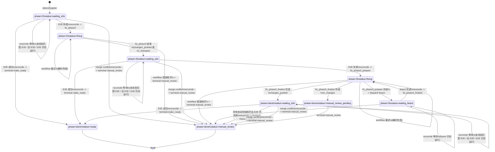

# Main2Main 状态转移说明

本文基于当前最终代码实现整理 `main2main` 的主要状态机，重点描述：

- 当前有哪些核心 `phase/status`
- 每个状态在什么条件下触发什么动作
- 动作执行后会进入哪个下一状态
- 哪些状态转移是“逻辑转移”，哪些是“分两步完成的实际转移”

本文描述的是**当前代码中的最终状态机行为**，不讨论中间 commit 的演进过程。

---

## 1. 主要状态图

下面这张 Mermaid 图描述的是 `main2main` 的主干状态流转。为了更容易阅读，图中把部分 workflow dispatch 的中间步骤折叠了；实际代码里，`reconcile` 往往会先刷新 `dispatch_token` 并更新 `last_transition`，然后由目标 workflow 写入最终状态。

---

## 2. 完整状态转移表

下表按“当前状态 -> 触发条件 -> 执行动作 -> 下一状态”的形式展开，尽量与代码实现一一对应。

| 当前 phase/status | 触发条件 | 执行动作 | 下一状态 |
|:--|:--|:--|:--|
| `-` | detect 流程创建新的 main2main PR | `prepare-detect-artifacts` 初始化 register/state comment | `phase=2, status=waiting_e2e` |
| `-` | reconcile 发现缺少 `main2main-state` comment，但可从 register 或 PR body 恢复 | bootstrap state 并补写 state comment | `phase=2, status=waiting_e2e` |
| `phase=2, status=waiting_e2e` | 还没有找到匹配当前 head SHA 的 E2E run | `reconcile -> wait` | 保持不变 |
| `phase=2, status=waiting_e2e` | 找到的 E2E run 对应的是旧 head SHA | `reconcile -> wait` | 保持不变 |
| `phase=2, status=waiting_e2e` | 匹配的 E2E run 还未完成 | `reconcile -> wait` | 保持不变 |
| `phase=2, status=waiting_e2e` | PR 出现 merge conflict | `reconcile -> dispatch terminal manual_review` | 逻辑上进入 `phase=done, status=manual_review` |
| `phase=2, status=waiting_e2e` | E2E 结果为成功 | `reconcile -> dispatch terminal make_ready` | 逻辑上进入 `phase=done, status=ready` |
| `phase=2, status=waiting_e2e` | E2E 结果为失败类结论 | `reconcile -> dispatch fix_phase2`，并先把 state 改成 `fixing` | `phase=2, status=fixing` |
| `phase=2, status=fixing` | `fix_phase2` 产生并推送了新提交 | `prepare-fix-transition(result=changes_pushed)` | `phase=3, status=waiting_e2e` |
| `phase=2, status=fixing` | `fix_phase2` 没有产生新提交 | `prepare-fix-transition(result=no_changes)` | `phase=3, status=waiting_e2e` |
| `phase=2, status=fixing` | `fix_phase2` workflow 失败，但仍有重试额度 | `prepare-workflow-error-recovery -> retry fix_phase2` | 保持 `phase=2, status=fixing` |
| `phase=2, status=fixing` | `fix_phase2` workflow 失败，且重试额度耗尽 | `prepare-workflow-error-recovery -> dispatch terminal manual_review` | 逻辑上进入 `phase=done, status=manual_review` |
| `phase=3, status=waiting_e2e` | 还没有找到匹配当前 head SHA 的 E2E run | `reconcile -> wait` | 保持不变 |
| `phase=3, status=waiting_e2e` | 找到的 E2E run 对应的是旧 head SHA | `reconcile -> wait` | 保持不变 |
| `phase=3, status=waiting_e2e` | 匹配的 E2E run 还未完成 | `reconcile -> wait` | 保持不变 |
| `phase=3, status=waiting_e2e` | PR 出现 merge conflict | `reconcile -> dispatch terminal manual_review` | 逻辑上进入 `phase=done, status=manual_review` |
| `phase=3, status=waiting_e2e` | E2E 结果为成功 | `reconcile -> dispatch terminal make_ready` | 逻辑上进入 `phase=done, status=ready` |
| `phase=3, status=waiting_e2e` | E2E 结果为失败类结论 | `reconcile -> dispatch fix_phase3_prepare`，并先把 state 改成 `fixing` | `phase=3, status=fixing` |
| `phase=3, status=fixing` | `fix_phase3_prepare` 成功发起 bisect | `prepare-waiting-bisect` | `phase=3, status=waiting_bisect` |
| `phase=3, status=fixing` | `fix_phase3_prepare` workflow 失败，但仍有重试额度 | `prepare-workflow-error-recovery -> retry fix_phase3_prepare` | 保持 `phase=3, status=fixing` |
| `phase=3, status=fixing` | `fix_phase3_prepare` workflow 失败，且重试额度耗尽 | `prepare-workflow-error-recovery -> dispatch terminal manual_review` | 逻辑上进入 `phase=done, status=manual_review` |
| `phase=3, status=waiting_bisect` | bisect 仍在运行 | `reconcile -> wait` | 保持不变 |
| `phase=3, status=waiting_bisect` | bisect 已完成，但 finalize callback 丢失或未执行 | `reconcile -> dispatch fix_phase3_finalize` | 中间仍保持 `phase=3, status=waiting_bisect`，随后 finalize workflow 会先改成 `fixing` |
| `phase=3, status=waiting_bisect` | `fix_phase3_finalize` workflow 启动 | `prepare-fixing-state` | `phase=3, status=fixing` |
| `phase=3, status=waiting_bisect` | finalize 前检测到 merge conflict | `reconcile -> dispatch terminal manual_review` | 逻辑上进入 `phase=done, status=manual_review` |
| `phase=3, status=fixing` | `fix_phase3_finalize` 产生并推送了新提交 | `prepare-fix-transition(result=changes_pushed)` | `phase=done, status=waiting_e2e` |
| `phase=3, status=fixing` | `fix_phase3_finalize` 没有产生新提交 | `prepare-manual-review-pending`，然后 dispatch terminal manual_review | 先进入 `phase=done, status=manual_review_pending`，再进入 `phase=done, status=manual_review` |
| `phase=3, status=fixing` | `fix_phase3_finalize` workflow 失败，但仍有重试额度 | `prepare-workflow-error-recovery -> retry fix_phase3_finalize` | 保持 `phase=3, status=fixing` |
| `phase=3, status=fixing` | `fix_phase3_finalize` workflow 失败，且重试额度耗尽 | `prepare-workflow-error-recovery -> dispatch terminal manual_review` | 逻辑上进入 `phase=done, status=manual_review` |
| `phase=done, status=waiting_e2e` | 还没有找到匹配当前 head SHA 的 E2E run | `reconcile -> wait` | 保持不变 |
| `phase=done, status=waiting_e2e` | 找到的 E2E run 对应的是旧 head SHA | `reconcile -> wait` | 保持不变 |
| `phase=done, status=waiting_e2e` | 匹配的 E2E run 还未完成 | `reconcile -> wait` | 保持不变 |
| `phase=done, status=waiting_e2e` | PR 出现 merge conflict | `reconcile -> dispatch terminal manual_review` | 逻辑上进入 `phase=done, status=manual_review` |
| `phase=done, status=waiting_e2e` | E2E 结果为成功 | `reconcile -> dispatch terminal make_ready` | 逻辑上进入 `phase=done, status=ready` |
| `phase=done, status=waiting_e2e` | 所有自动阶段已耗尽，但 E2E 仍失败 | `reconcile -> dispatch terminal manual_review(reason=done_failure)` | 逻辑上进入 `phase=done, status=manual_review` |
| `phase=done, status=manual_review_pending` | terminal workflow 正常执行 | `dispatch_main2main_terminal.yaml action=manual_review` | `phase=done, status=manual_review` |
| `phase=done, status=ready` | 终态 | 无自动后续转移 | 终态 |
| `phase=done, status=manual_review` | 终态 | 无自动后续转移 | 终态 |

---

## 3. 需要特别注意的两点

### 3.1 有些转移是“两步完成”的

下面这几类动作在代码里不是一步直接改到终态，而是分两步完成：

- `dispatch_make_ready`
- `dispatch_manual_review`
- `dispatch_fix_phase3_finalize`

实际流程通常是：

1. `reconcile` 先生成新的 `dispatch_token`，并把 `last_transition` 写到 `main2main-state` 中。
2. 目标 workflow 被 dispatch 后，再根据自己的执行结果把状态写成最终值。

也就是说，表格里写的“逻辑上进入某状态”，有时并不是在 `reconcile` 那一步立即写死，而是由后续 workflow 完成最终落盘。

### 3.2 `phase=3, status=fixing` 被两个 workflow 复用

`phase=3, status=fixing` 这个状态需要特别小心，因为它并不只表示一种动作：

- 一种情况是 `fix_phase3_prepare`
    - 目标是收集 E2E 失败信息
    - 构造 bisect 输入
    - 发起 bisect
    - 最终进入 `waiting_bisect`

- 另一种情况是 `fix_phase3_finalize`
    - 目标是消费 bisect 结果
    - 进行定向修复
    - 成功时回到 `phase=done, status=waiting_e2e`
    - 失败或无变更时进入 manual review 路径

所以阅读状态时，不能只看 `phase/status`，还要结合：

- `last_transition`
- `fix_run_id`
- `bisect_run_id`

来判断当前到底处于 phase 3 的哪一个子阶段。

---

## 4. 状态机的核心理解

如果只抓主线，可以把当前 `main2main` 理解成下面这条自动化链路：

1. `detect` 创建 PR，并初始化为 `phase=2, status=waiting_e2e`
2. `reconcile` 盯住 E2E 结果
3. phase 2 失败则进入 `fix_phase2`
4. phase 2 结束后统一进入 `phase=3, status=waiting_e2e`
5. phase 3 再失败则进入 `fix_phase3_prepare -> waiting_bisect -> fix_phase3_finalize`
6. finalize 成功则进入 `phase=done, status=waiting_e2e` 再跑最后一轮 E2E
7. 最后一轮 E2E 成功则 `ready`
8. 任意阶段若出现 merge conflict、重试耗尽、或最终仍失败，则进入 `manual_review`

从控制平面的角度看，`reconcile` 才是主控制器，而：

- `schedule_main2main_auto.yaml` 负责 detect / fix
- `dispatch_main2main_bisect.yaml` 负责 bisect
- `dispatch_main2main_terminal.yaml` 负责最终 ready / manual_review 落地

---

## 5. 相关文件

- `schedule_main2main_auto.yaml`
- `schedule_main2main_reconcile.yaml`
- `dispatch_main2main_terminal.yaml`
- `dispatch_main2main_bisect.yaml`
- `.github/workflows/scripts/main2main_ci.py`

如果需要，我可以下一步继续把这个中文版扩成两种形式之一：

- 直接用于 issue/RFC 的“正式说明版”
- 面向开发者阅读的“源码对应版”，把每条状态转移映射到具体函数和 workflow step
