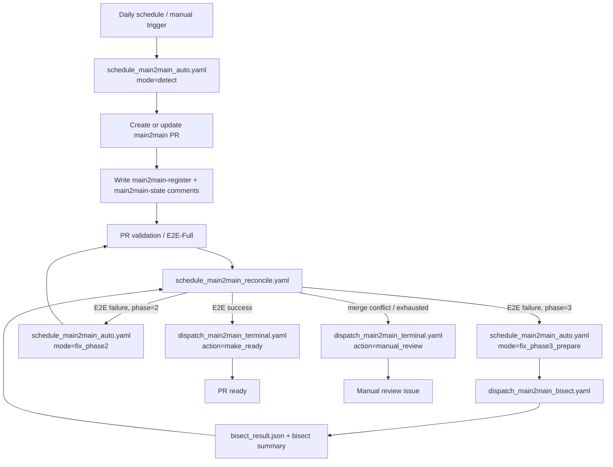
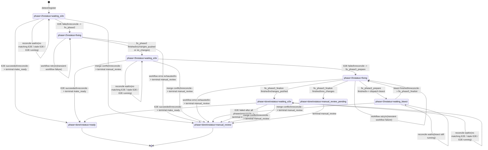

# RFC #7074 Rewrite Draft

Issue reference: `vllm-project/vllm-ascend#7074`

This document is a full markdown rewrite draft for the existing RFC issue, updated to match the **current final main2main implementation**.

---

## Suggested Title

`[RFC]: Workflow-Native Main2Main Automation for vllm-ascend`

## Suggested Markdown Body

```markdown
### Motivation.

vllm-ascend must continuously track the upstream vLLM main branch to stay compatible. Today, upstream drift can still trigger repeated manual diagnosis, targeted fixing, bisecting, and CI re-validation, which is costly and slow.

The goal of `main2main` is to automate that loop as much as possible: proactively create adaptation PRs, automatically diagnose and repair simple regressions, run bisect-assisted recovery for harder failures, and fall back to manual review only when the automated path is exhausted.

The final goal remains:

- **high auto-fix rate for simple failures**
- **useful automated recovery for complex failures**
- **automatic creation and progression of a ready-to-review PR whenever the automated path succeeds**

### Background

vLLM is a fast-moving project with frequent upstream changes. As a plugin/backend project, vllm-ascend depends on many internal vLLM interfaces through overrides, patching, backend-specific implementations, and custom execution paths. This makes it highly sensitive to upstream refactors, signature changes, config changes, and execution-path changes.

Earlier versions of the `main2main` design explored a hybrid architecture with GitHub Actions plus a local orchestration service and MCP control plane. After implementation and iteration, the final direction is now different:

- the **execution plane** is GitHub Actions
- the **control plane** is also GitHub Actions
- the **live state carrier** is the PR itself, via structured PR comments
- no production path depends on a long-lived local daemon or local service-side state file

### Proposed Change.

Implement `main2main` as a **workflow-native orchestration system** built on focused GitHub Actions workflows plus one shared workflow-side state-machine helper.

### Problem Statement

1. A scheduled detect-and-adapt flow must continuously watch for upstream vLLM main branch drift.
2. Once drift is detected, the system must create or update a `main2main` PR automatically.
3. The PR must be validated by the existing PR-triggered CI flow.
4. If validation fails, the system must classify the result and decide whether to:
   - run an automated phase 2 fix
   - run a bisect-assisted phase 3 fix
   - stop automation and create a manual-review issue
5. The system must preserve state safely across many workflow runs, including long-running bisect workflows.
6. The system must defend against stale callbacks, stale workflow runs, and partial completion.

### Design

The final solution is a **workflow-native main2main control plane** composed of four workflows and one shared orchestration helper script.

#### Architecture Overview



Compared with the original RFC direction, the final implementation no longer uses PR labels as the state machine, and no longer depends on a local persistent orchestration service. The PR comment state is now the live source of truth, and reconcile is performed by scheduled/manual GitHub Actions workflows.

#### State Model

Each `main2main` PR carries two structured comments:

1. `main2main-register`
   - bootstrap metadata
   - PR number
   - branch
   - head SHA
   - old/new vLLM commit range
   - current phase

2. `main2main-state`
   - single live source of truth
   - current phase
   - current status
   - current run ids
   - dispatch token
   - terminal reason
   - transition metadata

A simplified state example:

```json
{
  "pr_number": 188,
  "branch": "main2main_auto_2026-04-03_08-22",
  "head_sha": "1ac49ff7b834177ba43fb7a3044269908bdcbef5",
  "old_commit": "35141a7eeda941a60ad5a4956670c60fd5a77029",
  "new_commit": "fa9e68022d29c5396dfbb96d13587b6bc1bdb933",
  "phase": "3",
  "status": "waiting_bisect",
  "e2e_run_id": "24000000000",
  "fix_run_id": "24000000001",
  "bisect_run_id": "24000000002",
  "dispatch_token": "m2m-188-phase3-20260407T120000Z",
  "terminal_reason": "",
  "last_transition": "fix_phase3_prepare->waiting_bisect",
  "updated_at": "2026-04-07T12:00:00Z",
  "updated_by": "schedule_main2main_auto.yaml/fix_phase3_prepare"
}
```

#### Why PR Comment State

This design solves several problems that are hard to solve well with PR labels or local state files alone:

- durable state across many workflow runs
- explicit recovery after failed callbacks
- direct visibility on the PR itself
- easier stale-run protection
- no separate production host/process required

#### Dispatch Token Guard

A fresh `dispatch_token` is generated before every outbound action attempt:

- reconcile -> `fix_phase2`
- reconcile -> `fix_phase3_prepare`
- reconcile -> terminal `make_ready`
- reconcile -> terminal `manual_review`
- `fix_phase3_prepare` -> bisect workflow
- reconcile recovery -> `fix_phase3_finalize`

Any callback or terminal workflow must match the current token in PR state before mutating state or performing side effects. This prevents stale runs from corrupting newer state.

#### State Transition Model

The following diagram shows the **major logical state machine**. For readability, it collapses some dispatch hops. In the actual implementation, `reconcile` may first rotate `dispatch_token` and patch `last_transition`, and the terminal/finalize workflow then writes the final state.



The table below expands the same logic into a **code-level transition table**.

| Current phase/status | Trigger / condition | Action | Next phase/status |
|:--|:--|:--|:--|
| `-` | detect flow creates new main2main PR | `prepare-detect-artifacts` initializes register + state comments | `phase=2, status=waiting_e2e` |
| `-` | reconcile finds no `main2main-state` comment but can recover from register / PR body | bootstrap state and write missing state comment | `phase=2, status=waiting_e2e` |
| `phase=2, status=waiting_e2e` | no matching E2E run yet | `reconcile -> wait` | unchanged |
| `phase=2, status=waiting_e2e` | matched E2E run head SHA does not equal current PR head | `reconcile -> wait` | unchanged |
| `phase=2, status=waiting_e2e` | matched E2E run is still running | `reconcile -> wait` | unchanged |
| `phase=2, status=waiting_e2e` | merge conflict detected | `reconcile -> dispatch terminal manual_review` | logically `phase=done, status=manual_review` |
| `phase=2, status=waiting_e2e` | E2E conclusion is `success` | `reconcile -> dispatch terminal make_ready` | logically `phase=done, status=ready` |
| `phase=2, status=waiting_e2e` | E2E conclusion is failure-like | `reconcile -> dispatch fix_phase2` and patch state to `fixing` | `phase=2, status=fixing` |
| `phase=2, status=fixing` | `fix_phase2` pushes new commits | `prepare-fix-transition(result=changes_pushed)` | `phase=3, status=waiting_e2e` |
| `phase=2, status=fixing` | `fix_phase2` produces no new commits | `prepare-fix-transition(result=no_changes)` | `phase=3, status=waiting_e2e` |
| `phase=2, status=fixing` | `fix_phase2` workflow fails and retry budget remains | `prepare-workflow-error-recovery -> retry fix_phase2` | unchanged `phase=2, status=fixing` |
| `phase=2, status=fixing` | `fix_phase2` workflow fails and retry budget is exhausted | `prepare-workflow-error-recovery -> dispatch terminal manual_review` | logically `phase=done, status=manual_review` |
| `phase=3, status=waiting_e2e` | no matching E2E run yet | `reconcile -> wait` | unchanged |
| `phase=3, status=waiting_e2e` | matched E2E run head SHA does not equal current PR head | `reconcile -> wait` | unchanged |
| `phase=3, status=waiting_e2e` | matched E2E run is still running | `reconcile -> wait` | unchanged |
| `phase=3, status=waiting_e2e` | merge conflict detected | `reconcile -> dispatch terminal manual_review` | logically `phase=done, status=manual_review` |
| `phase=3, status=waiting_e2e` | E2E conclusion is `success` | `reconcile -> dispatch terminal make_ready` | logically `phase=done, status=ready` |
| `phase=3, status=waiting_e2e` | E2E conclusion is failure-like | `reconcile -> dispatch fix_phase3_prepare` and patch state to `fixing` | `phase=3, status=fixing` |
| `phase=3, status=fixing` | `fix_phase3_prepare` dispatches bisect successfully | `prepare-waiting-bisect` | `phase=3, status=waiting_bisect` |
| `phase=3, status=fixing` | `fix_phase3_prepare` workflow fails and retry budget remains | `prepare-workflow-error-recovery -> retry fix_phase3_prepare` | unchanged `phase=3, status=fixing` |
| `phase=3, status=fixing` | `fix_phase3_prepare` workflow fails and retry budget is exhausted | `prepare-workflow-error-recovery -> dispatch terminal manual_review` | logically `phase=done, status=manual_review` |
| `phase=3, status=waiting_bisect` | bisect is still running | `reconcile -> wait` | unchanged |
| `phase=3, status=waiting_bisect` | bisect is finished and finalize callback is still missing | `reconcile -> dispatch fix_phase3_finalize` | intermediate state stays `phase=3, status=waiting_bisect`, then finalize workflow marks `fixing` |
| `phase=3, status=waiting_bisect` | `fix_phase3_finalize` job starts | `prepare-fixing-state` | `phase=3, status=fixing` |
| `phase=3, status=waiting_bisect` | merge conflict detected before finalize | `reconcile -> dispatch terminal manual_review` | logically `phase=done, status=manual_review` |
| `phase=3, status=fixing` | `fix_phase3_finalize` pushes new commits | `prepare-fix-transition(result=changes_pushed)` | `phase=done, status=waiting_e2e` |
| `phase=3, status=fixing` | `fix_phase3_finalize` produces no new commits | `prepare-manual-review-pending`, then dispatch terminal manual_review | `phase=done, status=manual_review_pending`, then `phase=done, status=manual_review` |
| `phase=3, status=fixing` | `fix_phase3_finalize` workflow fails and retry budget remains | `prepare-workflow-error-recovery -> retry fix_phase3_finalize` | unchanged `phase=3, status=fixing` |
| `phase=3, status=fixing` | `fix_phase3_finalize` workflow fails and retry budget is exhausted | `prepare-workflow-error-recovery -> dispatch terminal manual_review` | logically `phase=done, status=manual_review` |
| `phase=done, status=waiting_e2e` | no matching E2E run yet | `reconcile -> wait` | unchanged |
| `phase=done, status=waiting_e2e` | matched E2E run head SHA does not equal current PR head | `reconcile -> wait` | unchanged |
| `phase=done, status=waiting_e2e` | matched E2E run is still running | `reconcile -> wait` | unchanged |
| `phase=done, status=waiting_e2e` | merge conflict detected | `reconcile -> dispatch terminal manual_review` | logically `phase=done, status=manual_review` |
| `phase=done, status=waiting_e2e` | E2E conclusion is `success` | `reconcile -> dispatch terminal make_ready` | logically `phase=done, status=ready` |
| `phase=done, status=waiting_e2e` | E2E conclusion is failure-like after all automated phases are used | `reconcile -> dispatch terminal manual_review(reason=done_failure)` | logically `phase=done, status=manual_review` |
| `phase=done, status=manual_review_pending` | terminal workflow runs successfully | `dispatch_main2main_terminal.yaml action=manual_review` | `phase=done, status=manual_review` |
| `phase=done, status=ready` | terminal state | no further automated transition | terminal |
| `phase=done, status=manual_review` | terminal state | no further automated transition | terminal |

Two implementation notes are important:

1. `dispatch_make_ready`, `dispatch_manual_review`, and `dispatch_fix_phase3_finalize` are **two-step transitions**.
   - step 1: `reconcile` rotates `dispatch_token` and patches `last_transition`
   - step 2: the target workflow writes the final state

2. `phase=3, status=fixing` is shared by **two different concrete workflows**.
   - `fix_phase3_prepare`: turns phase 3 E2E failures into `waiting_bisect`
   - `fix_phase3_finalize`: consumes bisect output and either returns to `done/waiting_e2e` or ends in manual review

#### Workflow Roles

##### `schedule_main2main_auto.yaml`

Main execution workflow.

Modes:

- `detect`
- `fix_phase2`
- `fix_phase3_prepare`
- `fix_phase3_finalize`

Responsibilities:

- detect upstream vLLM drift
- create/update the main2main PR
- initialize PR comment state
- run Claude-driven phase 2 repair
- prepare and dispatch phase 3 bisect
- finalize phase 3 with bisect-guided repair

##### `schedule_main2main_reconcile.yaml`

Scheduled/manual reconcile workflow.

Responsibilities:

- list open `main2main` PRs
- initialize missing state comments
- resolve `waiting_e2e`
- resolve `waiting_bisect`
- dispatch the next action
- recover bisect-finished/finalize-missing situations

##### `dispatch_main2main_terminal.yaml`

Terminal action workflow.

Responsibilities:

- mark PR ready
- generate manual-review context
- create a manual-review issue
- patch PR state to `ready` or `manual_review`

##### `dispatch_main2main_bisect.yaml`

Bisect executor workflow.

Responsibilities:

- run bisect in standalone or main2main mode
- generate `bisect_result.json`
- upload markdown and JSON artifacts
- route completion back through reconcile instead of directly mutating final state

#### Shared Orchestration Helper

##### `.github/workflows/scripts/main2main_ci.py`

This script is the workflow-side state-machine helper.

Responsibilities:

- PR comment state I/O
- comment parsing/rendering
- stale guard checks
- PR/state/register consistency checks
- reconcile decisions
- transition preparation
- bisect payload preparation
- workflow-error recovery handling

This keeps business logic concentrated in one place instead of scattering state-machine rules across many YAML fragments.

#### Supporting Analysis / Bisect Tools

| Component | Description | link |
|:--|:--|:--|
| `schedule_main2main_auto.yaml` | Main detect/fix workflow | TBD |
| `schedule_main2main_reconcile.yaml` | Scheduled/manual reconcile workflow | TBD |
| `dispatch_main2main_terminal.yaml` | Terminal ready/manual-review workflow | TBD |
| `dispatch_main2main_bisect.yaml` | Bisect workflow for phase 3 regression isolation | TBD |
| `main2main_ci.py` | Shared workflow-side state-machine helper | TBD |
| `ci_log_summary.py` | CI log analysis entrypoint for failure summarization and bisect payload generation | https://github.com/vllm-project/vllm-ascend/pull/7202 |
| `tools/bisect_helper.py` | Bisect matrix/env helper and result aggregation utility | TBD |
| `tools/bisect_vllm.sh` | Shell bisect executor used by the bisect workflow | TBD |
| `main2main` skill | Proactive adaptation and upgrade reasoning skill | https://github.com/vllm-project/vllm-ascend/pull/6817 |
| `main2main-error-analysis` skill / unified diagnostic flow | CI failure diagnosis and targeted fix generation | https://github.com/vllm-project/vllm-ascend/pull/6983 |

### Why This Architecture

Compared with the earlier RFC direction, the workflow-native design has several advantages:

1. **No production daemon**
   - no local service process to deploy, monitor, or restart

2. **No split-brain state**
   - workflow state and control decisions are GitHub-hosted
   - the PR itself carries the source of truth

3. **Long-running bisect is recoverable**
   - `waiting_bisect` is an explicit persistent state
   - reconcile can recover finalize dispatch if the callback path is interrupted

4. **Safer stale-run handling**
   - token-guarded callbacks prevent older runs from overwriting newer state

5. **Shorter workflow contracts**
   - fix workflows receive only `pr_number`, `dispatch_token`, and optionally `bisect_run_id`
   - the rest of the context is loaded from PR comments

### Scope Delivered

The current implementation delivers:

- automated detect-and-adapt PR creation
- PR comment based main2main state tracking
- scheduled/manual reconcile
- automated phase 2 repair
- automated phase 3 bisect dispatch
- bisect artifact generation with machine-readable JSON results
- phase 3 finalize workflow
- terminal ready/manual-review actions
- shared workflow-side state-machine helper
- CI log summary integration for diagnostic context

### Non-Goals

- automatic merge conflict resolution
- automatic upstream fix submission to vLLM
- changing the existing PR-triggered validation workflow semantics
- generalizing this system to arbitrary repositories
- preserving the old local service/MCP architecture as a supported production path

### TODO list

- [x] add a skill to analyze the root cause of failing CI and identify likely upstream commits, then generate targeted fixes
- [x] add an automated bisect workflow to pinpoint first bad upstream vLLM commits and generate structured summaries
- [x] establish a workflow-native `main2main` pipeline for autonomous detect, reconcile, fix, bisect, and terminal actions
- [x] add CI log summary integration for reusable workflow-side failure analysis
- [ ] improve fix coverage and adaptation quality for harder failures
- [ ] improve manual-review handoff quality and issue content
- [ ] add stronger architecture/context learning for vLLM and vllm-ascend cross-module reasoning
- [ ] add an explicit path for failures that should be fixed in upstream vLLM rather than in vllm-ascend

### Feedback Period.

weekly

### CC List.

@MengqingCao @wjunLu

### Any Other Things.

This RFC originally explored a local orchestration service + MCP control plane model. The final implementation direction has since converged on workflow-native orchestration. This RFC is updated to reflect the current production architecture rather than the earlier intermediate design.
```

---

## Notes

- The `link` column intentionally keeps several `TBD` placeholders because the exact PR/commit URLs were not added here.
- If you want, the next step can be to replace those `TBD` values with exact PR links.
- This draft is written to match the current issue's RFC style: Motivation, Background, Proposed Change, Problem Statement, Design, TODO list, Feedback Period, and CC List.
