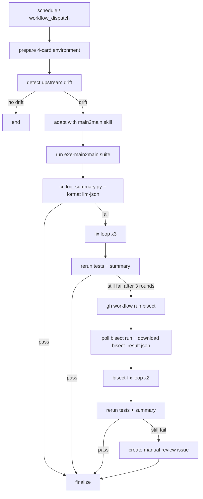

# Main2Main Simplified Workflow Design

**Status:** Revised approved design draft

## Goal

Replace the current main2main control plane with a simpler model:

- one main workflow owns the full adaptation loop
- one main 4-card job performs detect, test, fix, and finalize
- one separate bisect workflow remains available as an execution helper
- no PR comment state machine
- no reconcile workflow
- no terminal workflow in the production path

The target flow is:

1. detect upstream vLLM drift
2. adapt code automatically
3. run the fixed `e2e-main2main` suite directly in the main job
4. run up to 3 rounds of fix
5. if still failing, run up to 2 rounds of `bisect -> bisect-fix`
6. push once at the end
7. create one draft PR
8. create a manual-review issue only if automation still fails

## Non-Goals

This design does not preserve compatibility with the old orchestration model.

Removed from the active production design:

- `main2main-register`
- `main2main-state`
- `dispatch_token`
- `schedule_main2main_reconcile.yaml`
- `dispatch_main2main_terminal.yaml` as an active path
- PR-comment-driven phase/status transitions

This design also does not introduce:

- dynamic convergence heuristics
- runtime-selectable test suites
- cross-job git state transfer
- partial resume across workflow runs

## Main Constraint

The workflow must avoid cross-job orchestration for the main adaptation path because:

- the 4-card environment setup is expensive
- detect, fix, and bisect-fix must share one live git worktree
- intermediate changes should be committed but not pushed
- the final PR description must summarize the exact commits produced in this single run

Because of that, the main workflow keeps one long-lived job and uses `gh workflow run` to trigger the separate bisect workflow when needed.

`workflow_call` is intentionally not used for bisect in this design.

## Proposed Architecture

### Active Workflows

1. `schedule_main2main_auto.yaml`
   - the only orchestration workflow
   - owns:
     - prepare
     - detect
     - initial test
     - fix loop
     - bisect dispatch and polling
     - bisect-fix loop
     - finalize

2. `dispatch_main2main_bisect.yaml`
   - a standalone bisect executor
   - triggered by the main workflow through `gh workflow run`
   - responsible only for locating likely bad commit(s) and publishing bisect artifacts

`dispatch_main2main_terminal.yaml` is no longer part of the production design.

### High-Level Flow



## Workflow Design

## 1. `schedule_main2main_auto.yaml`

### Triggers

Keep two entry points:

- `schedule`
- `workflow_dispatch`

Only one manual input is required:

- `target_commit`
  - optional
  - if empty, use upstream `main` HEAD
  - if present, run against that exact commit

Do not keep old state-machine inputs such as:

- `mode`
- `pr_number`
- `dispatch_token`
- `bisect_run_id`

### Runner and Environment

The main workflow runs in one 4-card Ascend environment, modeled after the existing `e2e-4-cards-full` job in [`_e2e_test.yaml`](../../.github/workflows/_e2e_test.yaml).

Use:

- `runs-on: linux-aarch64-a3-4`
- the same or equivalent Ascend container image
- the same base dependency setup used by the existing 4-card E2E job

The suite is fixed to `e2e-main2main`. No 2-card/4-card split is introduced.

### Single Main Job

Use one main job for the full orchestration path.

Reason:

- environment setup happens once
- one shared worktree remains alive for detect, fix, and bisect-fix
- commits can accumulate locally without push
- no `git bundle` or cross-job restore is needed

### Main Job Stages

The main job should expose these visible stages:

1. prepare
2. detect
3. initial test
4. fix loop
5. bisect dispatch + bisect-fix loop
6. finalize

Shell steps or helper scripts may be used inside each stage, but the stage boundaries should remain readable in the workflow file.

## 2. `dispatch_main2main_bisect.yaml`

### Entry Model

The bisect workflow remains a separate file and stays `workflow_dispatch` based.

It is triggered from the main job with `gh workflow run`.

It is not part of a reusable-workflow DAG and does not use `workflow_call`.

### Responsibilities

It should only:

- accept bisect inputs
- resolve matrix and environment
- run `tools/bisect_vllm.sh`
- aggregate bisect results
- upload structured artifacts

It must not:

- callback to reconcile
- patch PR comments
- manage main2main state
- decide the next action

### Inputs

The active bisect contract should be reduced to:

- `good_commit`
- `bad_commit`
- `test_cmd`
- `request_id`
  - unique per bisect request
  - used by the main workflow to find the correct run and artifact

### Outputs

The bisect workflow must publish at least:

- `bisect_result.json`
- optional `bisect_summary.md`

The authoritative machine contract is `bisect_result.json`.

## Stage Contracts

### Stage 1: Prepare

#### Inputs

- current repo checkout
- upstream vLLM checkout
- GitHub authentication
- Claude credentials
- 4-card Ascend container environment

#### Actions

- checkout `nv-action/vllm-benchmarks`
- checkout `vllm-project/vllm`
- configure git identity
- validate `gh` auth
- prepare Claude config
- install system dependencies
- install upstream `vllm` from source
- install current repo from source

#### Outputs

- one ready working directory
- one active git branch context for later commits

#### Failure Handling

If prepare fails, the workflow stops immediately and no PR or issue is created.

### Stage 2: Detect

#### Inputs

- current pinned commit
- target upstream commit

#### Actions

- compute `old_commit` and `new_commit`
- if they are equal, exit successfully with no PR
- otherwise create a local working branch
- run the `main2main` skill against the drift
- if the worktree changed, commit the change locally

#### Outputs

- `old_commit`
- `new_commit`
- `working_branch`
- `detect_changed`

#### Failure Handling

If drift exists but detect fails before any useful output is produced, the workflow stops and does not create a PR.

### Stage 3: Initial Test

#### Inputs

- current worktree
- fixed suite `e2e-main2main`

#### Actions

Run:

```bash
python3 .github/workflows/scripts/run_suite.py \
  --suite e2e-main2main \
  --continue-on-error \
  2>&1 | tee /tmp/main2main-test.log

python3 .github/workflows/scripts/ci_log_summary.py \
  --step-name "Run main2main suite" \
  --log-file /tmp/main2main-test.log \
  --format llm-json \
  --output /tmp/main2main-summary.json
```

#### Outputs

- `/tmp/main2main-test.log`
- `/tmp/main2main-summary.json`
- `test_passed`

#### Routing

- if tests pass, go to finalize
- if tests fail, enter the fix loop

### Stage 4: Fix Loop

#### Budget

Maximum 3 rounds.

#### Per-Round Actions

For each round:

1. load `/tmp/main2main-summary.json`
2. ask Claude to repair the current failure set
3. if the worktree changed, commit locally with a detailed message
4. rerun the fixed `e2e-main2main` suite with `--continue-on-error`
5. regenerate `/tmp/main2main-summary.json`

#### Routing

- if any round passes, go to finalize
- if all 3 rounds fail, enter bisect dispatch

No convergence heuristics are applied in this version.

### Stage 5: Bisect Dispatch and Bisect-Fix Loop

#### Budget

Maximum 2 rounds.

Each bisect-fix round is:

1. extract a deterministic `test_cmd` from `/tmp/main2main-summary.json`
2. generate a unique `request_id`
3. trigger `dispatch_main2main_bisect.yaml` with `gh workflow run`
4. poll GitHub Actions until the matching bisect run completes
5. download `bisect_result.json`
6. ask Claude to repair using:
   - current summary JSON
   - `bisect_result.json`
   - commit range context
7. if the worktree changed, commit locally
8. rerun tests and regenerate summary JSON

#### Matching the Correct Bisect Run

The main job should not guess based only on the workflow name.

It should correlate the correct bisect run using the unique `request_id`, which must appear in:

- the workflow dispatch inputs
- the bisect run name, title, or emitted artifact metadata

This avoids confusing a stale bisect run with the current request.

#### Routing

- if any bisect-fix round passes, go to finalize
- if 2 rounds fail, mark `manual_review_required=true`

#### Failure Handling

If the bisect workflow cannot return a valid `bisect_result.json`, mark `manual_review_required=true` and continue to finalize.

### Stage 6: Finalize

#### Responsibilities

Finalize is the only exit stage once drift exists.

It must:

- collect all commits created in this run
- summarize final status
- push the branch once
- create one draft PR
- create a manual-review issue only when required

#### Commit Collection

The PR body must include every locally created commit from this run in chronological order.

Format:

- `short sha`
- full commit message

#### PR Title

Recommended format:

```text
feat: adapt to vLLM main (<old_short>...<new_short>)
```

#### PR Body

The PR body should include:

- summary
- commit range
- final execution result
- fix rounds used
- bisect-fix rounds used
- all generated commits using `short sha + full commit message`

#### Manual Review Issue

If `manual_review_required=true`, the main workflow creates an issue that includes:

- final failure summary
- commit range
- draft PR URL
- last summary JSON digest
- bisect findings when present

`dispatch_main2main_terminal.yaml` is not used.

#### Zero-Commit Path

If drift exists but the entire run creates zero new commits:

- do not create a PR
- do not create a manual-review issue
- end the workflow with a clear log message that no code adaptation was produced

This avoids opening empty PRs with no actionable delta.

## Supporting Scripts

The design assumes the workflow can rely on:

- `.github/workflows/scripts/run_suite.py`
- `.github/workflows/scripts/ci_log_summary.py`
- a small helper CLI such as `.github/workflows/scripts/main2main_simplified.py`

The helper CLI should provide shell-friendly subcommands for:

- summary classification
- bisect command extraction
- bisect run lookup and polling
- commit collection
- PR body rendering
- manual-review issue rendering

## Deterministic Contracts

### Local Summary JSON Contract

The main workflow should only depend on these summary fields:

- `failed_test_files`
- `failed_test_cases`
- `code_bugs`
- `env_flakes`

### Bisect Test Command Extraction

The deterministic rule is:

1. prefer `failed_test_cases` if non-empty
2. otherwise fall back to `failed_test_files`
3. construct one bisect command from the first representative failure set

The first version does not attempt multi-command bisect.

### PR / Issue Creation Rule

- no drift -> no PR, no issue
- drift but zero new commits -> no PR, no issue
- drift with at least one new commit and final tests pass -> push + draft PR
- drift with at least one new commit and final tests still fail -> push + draft PR + manual-review issue

## Validation Strategy

Validation should focus on orchestration correctness before end-to-end quality.

### Static Validation

- validate the rewritten `schedule_main2main_auto.yaml`
- validate the simplified `dispatch_main2main_bisect.yaml`
- confirm old state-machine-only inputs and callbacks are removed from the active path

### Script Contract Validation

- verify `ci_log_summary.py --log-file --format llm-json` returns the required fields
- verify helper CLI can extract deterministic bisect commands
- verify helper CLI can find and poll the correct bisect run by `request_id`

### Workflow Validation Scenarios

1. no drift
   - workflow exits cleanly with no PR
2. drift, detect/test pass without fixes
   - one draft PR created
3. drift, fix loop succeeds
   - one draft PR created with multiple local commits
4. drift, bisect-fix succeeds
   - one draft PR created and bisect artifact consumed correctly
5. drift, bisect-fix still fails
   - one draft PR and one manual-review issue created

## Summary

The simplified production design is:

- one main workflow
- one main 4-card job
- one separate bisect workflow triggered with `gh workflow run`
- fixed `e2e-main2main` test suite
- up to 3 fix rounds
- up to 2 bisect-fix rounds
- local commits during the run, one push at the end
- one final draft PR
- optional manual-review issue

This keeps the expensive environment alive for the full adaptation loop while still allowing bisect to remain operationally separate.
